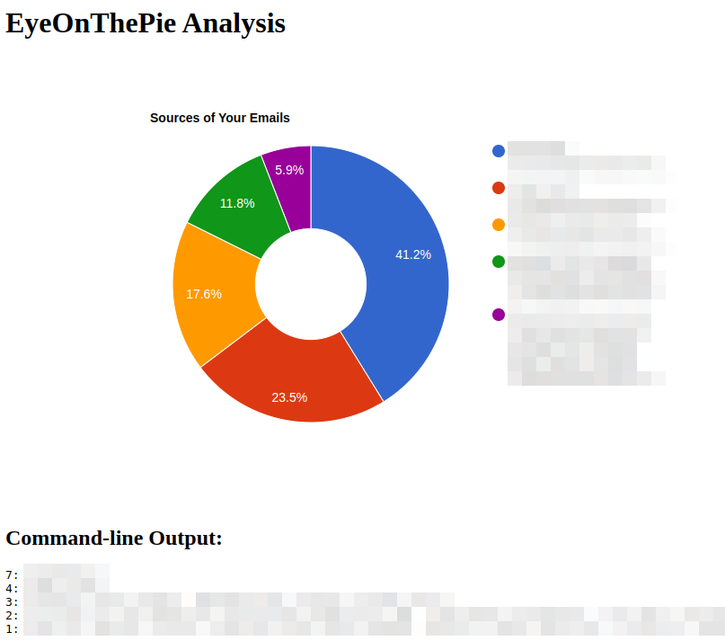

# eyeonthepie
Reads the email messages in your Gmail inbox and creates a pie chart describing the senders

# Purpose
I have a lot of emails, thousands in fact. I'd like to know who the majority of the emails are sent from, and thats what this program does.

Once I know who they are sent from, I can make filters and manage my emails more effectively.

If you have the same problem then this program can help you.

# Screenshot


# How to Use
The program was written to be utilized on Linux, however it utilizes python and Golang so it should be cross-platform.

1. Create a Project, add the Gmail API to it, create credentials, and download a valid client_secret.json from console.cloud.google.com. Rename it eyeonthepie_client_secret.json and save it in $HOME.
2. Run `pip3 install -r requirements.txt`
3. Run the program that gathers all the sender emails like so
```
Use the $HOME and go through the first 5000 emails:
./eyeonthepie.py

-OR-

Specify the client_secret.json location and number of emails to read (1000 emails in this case):
./eyeonthepie.py -c 1000 -f `pwd`/client_secret.json
```
4. Compile the golang program if you want, or simply run the program that generates the pie chart like so
```
go run eyeonthepie_analyze.go
```
5. Load pie.html in your favorite webbrowser

# TODO
1. Dummyproof the program, there are no sanity checks against fuzzing attacks sent from the CLI
2. Create a single script/interface that wraps around both programs